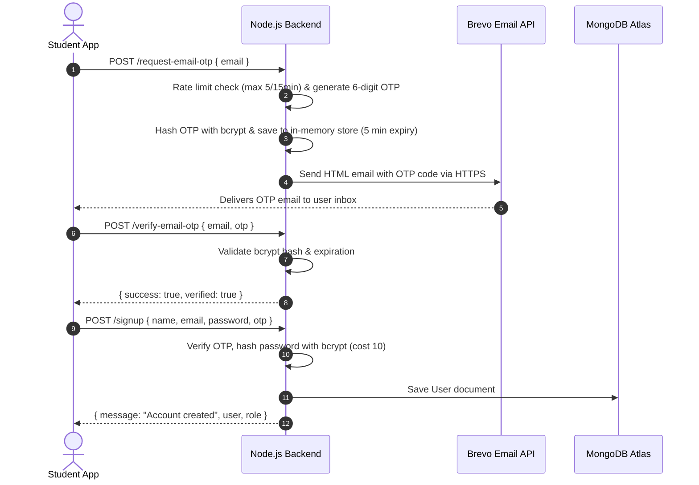
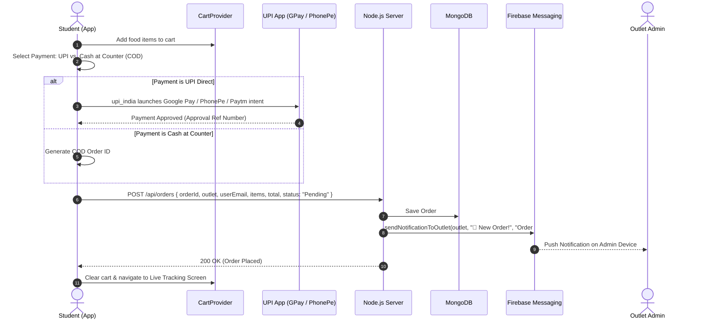
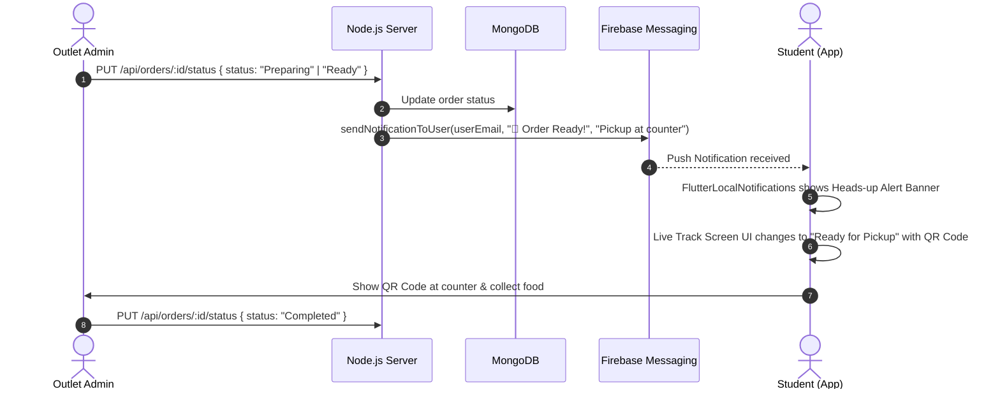
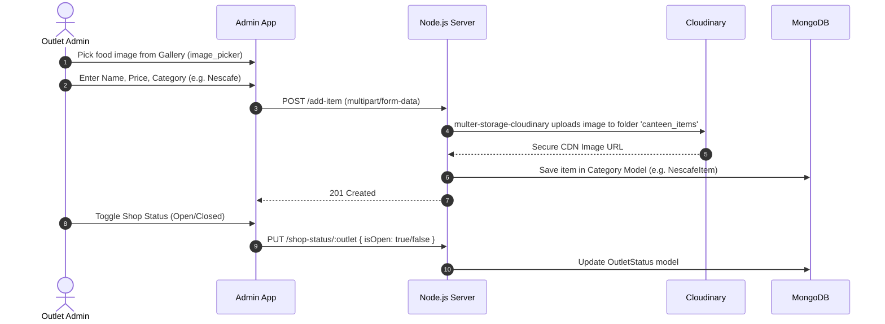

# 🍽️ Hunger Zone (GGI Canteen) — Complete Tech Stack & Architecture Flow

> **Comprehensive Technical Architecture, Tech Stack Breakdown, End-to-End System Flows, and Tooling Inventory.**

---

## 📌 1. Executive Summary

**Hunger Zone** is a campus canteen food ordering and management ecosystem built for colleges and universities. It bridges students (consumers), canteen outlet operators, and administrators across multiple campus food outlets (**Nescafe, Lipton, Main Canteen, and Fruit Corner**).

The ecosystem consists of:
1. **Cross-Platform Mobile Application** built in **Flutter (Dart)** for Android and iOS.
2. **Backend REST API** built in **Node.js & Express.js** hosted on **Render**.
3. **Cloud Database** powered by **MongoDB Atlas**.
4. **Push Notification Infrastructure** via **Firebase Cloud Messaging (FCM)** and **Flutter Local Notifications**.
5. **Transactional Email Engine** via **Brevo API (HTTPS)** / **Resend** / **Nodemailer**.
6. **Media Cloud Storage** via **Cloudinary**.
7. **Hybrid Payment Engine** supporting **UPI Direct Intent (Google Pay, PhonePe, Paytm)** and **Cash at Counter (COD)**.

---

## 🛠️ 2. Comprehensive Tech Stack & Tooling Directory

### A. Frontend Mobile Client (Flutter)

| Tool / Package | Version | Purpose in Project |
| :--- | :--- | :--- |
| **Flutter SDK** | `^3.10.7` | Core cross-platform UI framework compiling natively to Android & iOS. |
| **Provider** | `^6.1.2` | Reactive State Management (`CartProvider`, `WishlistProvider`, `OutletProvider`, `ThemeProvider`, `AuthService`). |
| **http** | `^1.2.0` | HTTP client for making REST API calls to the Node.js backend. |
| **flutter_dotenv** | `^5.1.0` | Loads runtime environment variables from `.env` (API URLs, UPI addresses, keys). |
| **upi_india** | `^3.0.1` | Native UPI payment intent launcher triggering Google Pay, PhonePe, Paytm, and BHIM apps directly on user devices. |
| **firebase_core** | `^3.6.0` | Initializes Firebase services within the Flutter engine. |
| **firebase_messaging** | `^15.1.3` | Listens for push notifications from the backend (foreground, background, and terminated states). |
| **flutter_local_notifications**| `^17.2.1+2` | Displays high-importance head-up notification banners on the mobile device when push notifications arrive. |
| **shared_preferences** | `^2.3.5` | Local persistent device storage for authentication sessions (7-day tokens, user profile, role, last login). |
| **cached_network_image** | `^3.4.1` | Caches food item photos locally in memory/disk to eliminate repeated network fetches and speed up UI rendering. |
| **google_fonts** | `^8.0.0` | Typography rendering (e.g., Poppins font family) for a modern aesthetic. |
| **qr_flutter** | `^4.1.0` | Generates QR codes on screen for order pickup and verification at the counter. |
| **image_picker** | `^1.1.2` | Allows admins and operators to select food item photos from camera or gallery for upload. |
| **fluttertoast** | `^8.2.10` | Non-intrusive toast messages for errors, validations, and success alerts. |
| **flutter_launcher_icons**| `^0.14.4` | Automates native launcher app icon generation across Android and iOS densities. |

---

### B. Backend API Server (Node.js & Express)

| Tool / Package | Version | Purpose in Project |
| :--- | :--- | :--- |
| **Node.js** | LTS | JavaScript server runtime. |
| **Express.js** | `^5.2.1` | Web framework routing HTTP requests, middlewares, and REST endpoints. |
| **MongoDB Atlas** | Cloud | Managed NoSQL cloud database hosting users, orders, outlet statuses, and menu items. |
| **Mongoose** | `^9.3.0` | Object Data Modeling (ODM) library defining schemas, validations, and queries for MongoDB. |
| **Firebase Admin SDK** | `^12.7.0` | Server-side Firebase integration sending target FCM push notifications to specific user device tokens. |
| **Cloudinary SDK** | `^1.41.3` | Cloud media management storing and serving optimized food item images. |
| **multer & multer-storage-cloudinary** | `^2.1.1` / `^4.0.0` | Multipart/form-data middleware handling direct image uploads to Cloudinary. |
| **bcryptjs** | `^2.4.3` | One-way cryptographic hashing for user passwords and in-memory OTP verification hashes. |
| **Brevo API (Sendinblue)**| HTTPS | Outbound transactional email delivery for 6-digit OTP verification codes (optimized for Render port restrictions). |
| **Nodemailer** | `^6.9.16` | Fallback SMTP email transporter for local development / VPS environments. |
| **cors** | `^2.8.6` | Cross-Origin Resource Sharing middleware enabling mobile/web clients to access the API. |
| **dotenv** | `^17.3.1` | Loads backend configuration keys from `.env`. |

---

### C. Cloud Services & Hosting Infrastructure

| Service | Category | Purpose |
| :--- | :--- | :--- |
| **Render** | Cloud Hosting | Hosts the Node.js Express API (`https://hunger-zone-api.onrender.com`). |
| **MongoDB Atlas** | Database | Cloud replica set database cluster. |
| **Google Firebase** | Messaging / Auth | Firebase Cloud Messaging (FCM) push notification routing to Android and iOS devices. |
| **Cloudinary** | CDN & Media | Hosts and serves menu food images with CDN optimization. |
| **Brevo (Sendinblue)**| Email Gateway | Delivers OTP emails over HTTPS without requiring open SMTP ports. |
| **Google Pay / NPCI**| Payment Gateway | Facilitates direct UPI merchant and peer-to-peer mobile payments. |

---

## 👥 3. Multi-Role Architecture

The system implements 3 distinct operational roles:

```
                          ┌──────────────────────────┐
                          │    Hunger Zone Users     │
                          └─────────────┬────────────┘
                                        │
             ┌──────────────────────────┼──────────────────────────┐
             ▼                          ▼                          ▼
   ┌───────────────────┐      ┌───────────────────┐      ┌───────────────────┐
   │  Student / User   │      │   Outlet Admin    │      │ Canteen Operator  │
   ├───────────────────┤      ├───────────────────┤      ├───────────────────┤
   │ • Browse Outlets  │      │ • Manage Menu     │      │ • Counter sales   │
   │ • Cart & Wishlist │      │ • Accept / Reject │      │ • Daily 24h OTP   │
   │ • UPI / COD Pay   │      │ • Update Status   │      │   check-in        │
   │ • Live Tracking   │      │ • Outlet Toggle   │      │ • Order handover  │
   │ • Order History   │      │ • Outlet Orders   │      │                   │
   └───────────────────┘      └───────────────────┘      └───────────────────┘
```

1. **Consumer (`user`)**:
   - Students and faculty members.
   - Registers/Logs in with verified email OTP.
   - 7-day persistent login session via `SharedPreferences`.
2. **Outlet Admins (`admin`, `admin_nescafe`, `admin_lipton`, `admin_canteen`, `admin_fruit`)**:
   - Dedicated dashboard for each campus outlet.
   - Real-time order stream for their specific outlet.
   - Ability to accept, prepare, mark ready, or reject orders.
   - Toggle outlet operational status (`Open` / `Closed`).
   - Add, edit, toggle availability, or delete food items with Cloudinary images.
3. **Canteen Operator (`operator`)**:
   - Physical counter staff.
   - Enforces **mandatory daily 24-hour OTP verification** to operate the counter terminal.

---

## 🔄 4. End-to-End System Flows

### Flow 1: Authentication & Email OTP Flow



---

### Flow 2: Ordering & Payment Flow



---

### Flow 3: Order Status & Live Notification Flow



---

### Flow 4: Menu Item & Outlet Management Flow



---

## 🗄️ 5. Database Schema & Data Models

### 1. `User` Schema
* `name`: `String` (Student / Admin Name)
* `email`: `String` (Unique, lowercase, primary identifier)
* `password`: `String` (bcrypt hashed)
* `role`: `String` (`user`, `admin`, `operator`, `admin_nescafe`, etc.)
* `outletName`: `String` (Assigned outlet for admin/operator)
* `emailVerified`: `Boolean`
* `fcmTokens`: `[String]` (List of device FCM tokens for multi-device push)
* `lastVerified`: `Date` (Used for operator 24h daily verification)

### 2. `Order` Schema
* `orderId`: `String` (Unique identifier e.g., `UPI171500000` or `COD171500000`)
* `outlet`: `String` (`Nescafe`, `Lipton`, `Canteen`, `Fruit Corner`)
* `userName`: `String`
* `userEmail`: `String` (Key for customer order history & FCM routing)
* `items`: `[{ name, quantity, price }]`
* `total`: `Number`
* `status`: `Enum ['Pending', 'Accepted', 'Preparing', 'Ready', 'Completed', 'Rejected']`
* `createdAt`: `Date`

### 3. `Item` Schemas (Separated by Outlet Collection)
* Models: `NescafeItem`, `LiptonItem`, `CanteenItem`, `FruitCornerItem`
* `name`: `String`
* `price`: `Number`
* `category`: `String`
* `imageUrl`: `String` (Cloudinary CDN URL)
* `isAvailable`: `Boolean` (Stock toggle)
* `createdAt`: `Date`

### 4. `OutletStatus` Schema
* `outlet`: `String` (Unique identifier)
* `isOpen`: `Boolean` (Controls whether student app accepts orders for this outlet)

---

## 🔒 6. Security & Reliability Highlights

1. **Password Encryption**: Uses `bcryptjs` with salt round 10. Passwords are never stored in plaintext.
2. **OTP Security**:
   - In-memory OTP storage is bcrypt-hashed.
   - 5-minute strict time-to-live (TTL).
   - Max 5 wrong verification attempts before automatic invalidation.
   - Rate limited to maximum 5 OTP requests per 15-minute window per email.
3. **Render Cloud Port Compatibility**: Render free tier blocks outbound SMTP ports (`25`, `465`, `587`). The backend dynamically routes transactional emails through **Brevo HTTP API on port 443**, guaranteeing 100% email delivery.
4. **Token Deduplication**: Uses MongoDB `$addToSet` and `$pull` operators for registering and pruning FCM tokens.
5. **Non-Blocking Notifications**: FCM push triggers run asynchronously without blocking the order creation response.

---

## 📁 7. File Structure Map

```
ggiCanteen/
├── .env.example                     # Environment template (Base URL, UPI, Keys)
├── pubspec.yaml                     # Flutter package dependencies
├── lib/
│   ├── main.dart                    # App bootstrap, Providers, Themes, Firebase Init
│   ├── models/
│   │   ├── cart_item.dart           # Cart item data model
│   │   ├── food_item.dart           # Menu item data model
│   │   └── user_model.dart          # User profile model
│   ├── providers/
│   │   ├── cart_provider.dart       # Cart state & calculations
│   │   ├── outlet_provider.dart     # Selected outlet state
│   │   ├── theme_provider.dart      # Dark/Light mode theme state
│   │   └── wishlist_provider.dart   # Favorites/Wishlist state
│   ├── services/
│   │   ├── auth_service.dart        # Session restore, login, signup, OTP API calls
│   │   └── notification_service.dart# FCM listeners & local push notification channel
│   ├── screens/
│   │   ├── splash_screen.dart       # Animated splash & auto session restore
│   │   ├── auth/                    # Login, Signup, OTP, Admin Login, Operator Check-in
│   │   ├── consumer/                # Home, Canteen, Nescafe, Cart, Track, History
│   │   └── admin/                   # Outlet dashboards, Add/Edit Item, Orders
│   └── utils/
│       ├── constants.dart           # Centralized environment constants
│       └── theme.dart               # Light & Dark design tokens
│
└── ggiCanteenBackend/               # Node.js Express REST API
    ├── server.js                    # Express app, Multer, Cloudinary, Auth, OTP endpoints
    ├── package.json                 # Backend dependencies
    ├── config/
    │   └── db.js                    # MongoDB Atlas connection
    ├── controllers/
    │   ├── authController.js        # Auth handlers
    │   └── orderController.js       # Order creation, outlet filter, status & push triggers
    ├── models/
    │   ├── Order.js                 # Order schema
    │   └── User.js                  # User & FCM tokens schema
    ├── routes/
    │   ├── authRoutes.js            # Auth routing
    │   ├── notificationRoutes.js    # Device FCM token registration/removal
    │   └── orderRoutes.js           # Order CRUD & status routing
    └── services/
        ├── emailService.js          # Brevo HTTPS / Resend / Nodemailer OTP sender
        └── firebaseNotificationService.js # Firebase Admin SDK push dispatcher
```
